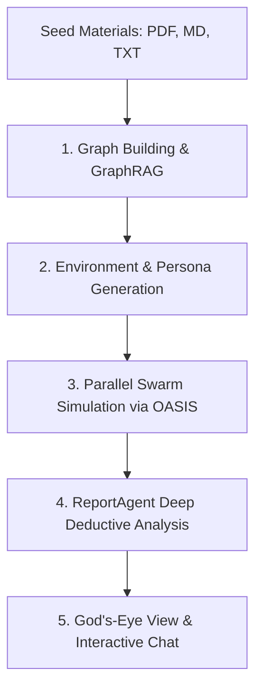

# MiroFish — Swarm Intelligence & Multi-Agent Prediction Engine

**MiroFish** is an autonomous multi-agent simulation and future-prediction platform developed by the open-source AI community. It transforms raw seed documents (news, historical accounts, policy drafts, corporate reports, or narratives) into high-fidelity parallel digital sandboxes populated by thousands of autonomous AI personas.

The persistent repository is located at:
`C:\Users\PC\.gemini\config\skills\mirofish\repo`

---

## 🏗️ Core Architecture & 5-Stage Pipeline



1. **Graph Building (`backend/app/services/graph_builder.py`)**:
   - Ingests and chunks source texts (PDF, Markdown, TXT).
   - Injects individual and collective memory into Zep Graph Memory / GraphRAG.
   - Extracts ontology: entities (people, factions, institutions) and relational edges.

2. **Environment & Persona Setup (`backend/app/services/oasis_profile_generator.py`)**:
   - Automatically derives hundreds of distinct agent personas with unique personality traits, behavioral biases, speaking tones, and social connections.
   - Injects social platform configurations (Twitter/X-style feeds and Reddit-style forums).

3. **Swarm Simulation (`backend/app/services/simulation_runner.py`)**:
   - Runs round-based parallel simulations using the CAMEL OASIS multi-agent framework.
   - Agents read feeds, make autonomous decisions (`CREATE_POST`, `LIKE_POST`, `REPOST`, `FOLLOW`, `CREATE_COMMENT`, `QUOTE_POST`), and continuously update their temporal memories.

4. **Report Generation (`backend/app/services/report_agent.py`)**:
   - Deploys an analytical ReportAgent with deep toolsets to evaluate post-simulation dynamics, viral nodes, sentiment shifts, and consensus points.
   - Generates comprehensive predictive reports and future scenario forecasts.

5. **Deep Interaction**:
   - Web dashboard allows users to observe live agent interactions, chat with any individual agent in the simulated world, and inject "what-if" variables dynamically.

---

## ⚙️ Environment Configuration

Configuration is managed in `C:\Users\PC\.gemini\config\skills\mirofish\repo\.env`:

```env
# ==========================================
# 1. LLM API Configuration (OpenAI SDK Compatible)
# ==========================================
LLM_API_KEY=your_api_key_here
LLM_BASE_URL=https://api.openai.com/v1
LLM_MODEL_NAME=gpt-4o-mini

# ==========================================
# 2. Zep Cloud Memory Graph Configuration
# ==========================================
ZEP_API_KEY=your_zep_api_key_here
```

---

## 🚀 How to Run & Work with MiroFish

### Option 1: Full Development Mode (Frontend + Backend)

Navigate to the repository directory:
```powershell
cd "C:\Users\PC\.gemini\config\skills\mirofish\repo"
```

1. **Install Dependencies**:
   ```powershell
   npm install
   cd frontend; npm install; cd ..
   cd backend; pip install -r requirements.txt; cd ..
   ```

2. **Run Backend & Frontend Concurrently**:
   ```powershell
   npm run dev
   ```
   - **Frontend UI**: `http://localhost:5173`
   - **Backend API**: `http://127.0.0.1:5000`

### Option 2: Headless Backend API

```powershell
cd "C:\Users\PC\.gemini\config\skills\mirofish\repo\backend"
python run.py
```
